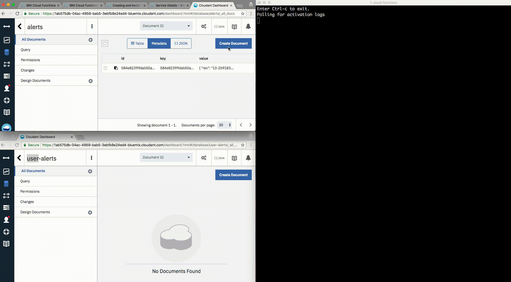

# OpenWhisk Alerts Demo

An OpenWhisk servleress example for user product alerts that takes a stream of generic product alerts and correlates them to the user's products to enable archive functionality on a per-user basis in a highly scalable way.

In this fictitious example, a user has an IBM Storwize storage product. This product is reaching capacity and emits alerts such as `10% disk space remaining`. While the product description is shared among many users in an organization, we would like to architect the database to allow each user in the organization to archive product alerts so they do not see the alert any more, while other users in the organization should continue seeing the alert. To accomplish this we need to create a cross-reference database that **s users to products and their archive state**, which is prime opportunity for a serverless fuction that executes on demand. 

### Implementation

An OpenWhisk function running in IBM Cloud Functions listens for Cloudant database changes (set this up through the OpenWhick UI), which triggers the function to process the alert for each applicable User and write to additional Cloudant databases that can be used by the UI showing alerts to the user 🔔

A Cloudant server of Users and Products databases contain the implicit relationship, for example a User document

```
{
  "_id": "drobertson",
  "username": "drobertson",
  "name": "Daniel",
  "product_ids": [
    "p620",
    "s8957"
  ]
}
```

and Product document

```
{
  "_id": "s8957",
  "product": "IBM Storwize System",
  "model": "8957"
}
```

When a new product alert arrives and the function is triggered, we need to find the users for a given product, which can be accomplished via a View (MapReduce)

```
function (doc) {
  if (doc.product_ids) {
        for (var pid in doc.product_ids) {
            emit(doc.product_ids[pid], doc);
        }
    }
}
```

New Cloudant documents are written for each user's product alert with metadata to provide additional features like archiving the alert in a UI dashboard
```
{
  "_id": "drobertson-s8957-Wed Jul 25 2018 15:54:11 GMT+0000 (UTC)",
  "user": "drobertson",
  "product": "s8957",
  "alert": "10% disk space remaining",
  "is_archived": false
}
```

### Demo 

